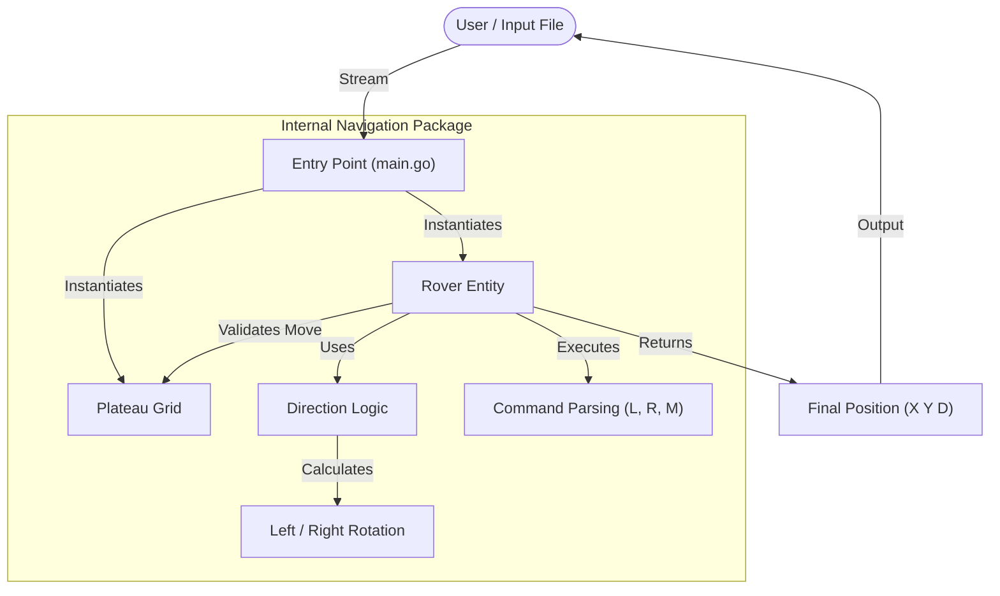

# Mars Rover Technical Challenge 🚀

A robust, production-grade Go implementation of the Mars Rover navigation problem. This solution focuses on **Clean Architecture**, **Test-Driven Development (TDD)**, and **Robust CLI Interaction**.

## 📋 Project Overview

A squad of robotic rovers are to be landed by NASA on a plateau on Mars. This application navigates them based on string inputs, calculating their final coordinates and heading.

### Key Features
* **Production-Grade Structure:** Uses the `internal/` pattern to isolate domain logic.
* **Zero Dependencies:** Built entirely with the Go Standard Library.
* **Robust Input Handling:** Supports both **File Piping** (Unix-style) and **Interactive CLI**.
* **Comprehensive Testing:** 100% coverage of logic, including boundary collisions and dirty input.

## 🏗 Architecture

The project is structured to separate the **Entry Point** (CLI) from the **Domain Logic** (Navigation).

How to Run
Prerequisites
Go 1.20 or higher

1. File Input Mode (Recommended)
This is the standard Unix way to run the application using input redirection.

# Run using the provided sample input
go run main.go < input.txt

Output:

1 3 N
5 1 E

2. Interactive Mode
You can also run the program manually. It features intelligent empty-line detection to determine when input is finished.

go run main.go
Paste your input and press ENTER on an empty line to finish.

Testing
The solution includes a comprehensive test suite.

# Run all tests with verbose output
go test -v ./...

Test Scenarios Covered:

✅ Happy Path: Standard movement and rotation.

✅ The "Cage" Test: Rovers attempting to move outside grid boundaries (ignored).

✅ Math Safety: 360-degree rotation logic (N -> L -> L -> L -> L -> N).

✅ Dirty Input: Graceful handling of invalid command characters.

.
├── main.go                # Application Entry Point & Input Parsing
├── internal/
│   └── navigation/        # Domain Logic (Library)
│       ├── direction.go   # Enum logic & rotation math
│       ├── plateau.go     # Grid validation
│       ├── rover.go       # State machine & movement
│       └── *_test.go      # Unit tests
├── input.txt              # Sample data
└── go.mod                 # Module definition

## ⚠️ Assumptions & Limitations

### Assumptions
1.  **Ghost Rovers (No Collision):** The requirements state that rovers move sequentially. I have assumed that rovers can share the same coordinate space (i.e., Rover 2 can stop at the same location as Rover 1 without crashing).
2.  **Grid Origin:** The lower-left coordinate is always fixed at `(0, 0)`.
3.  **Flat Terrain:** The plateau is assumed to be obstacle-free; only the outer grid boundaries restrict movement.

### Limitations
1.  **Concurrency:** The solution processes rovers strictly sequentially (Single-Threaded). While Go excels at concurrency, the requirements specified sequential operation.
2.  **Integer Bounds:** Coordinates are parsed as standard `int`. Extremely large coordinates (exceeding system integer limits) are not explicitly handled.

